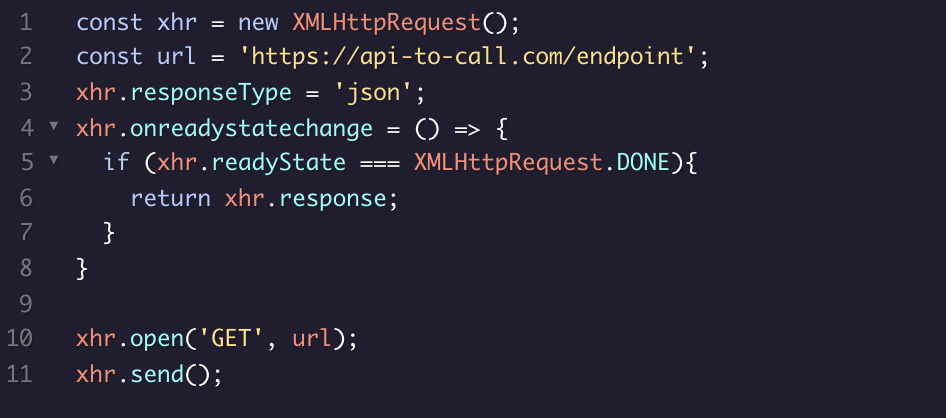
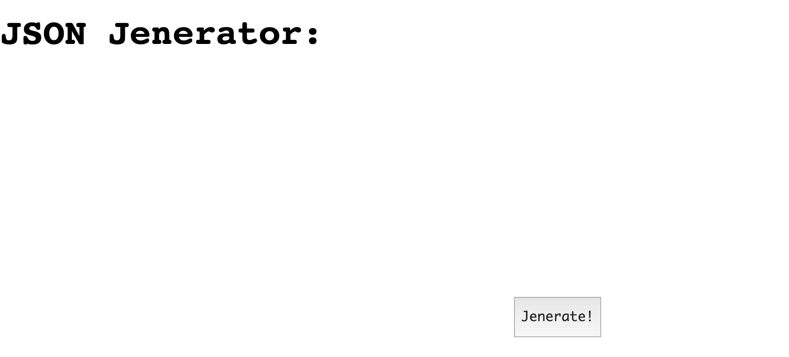
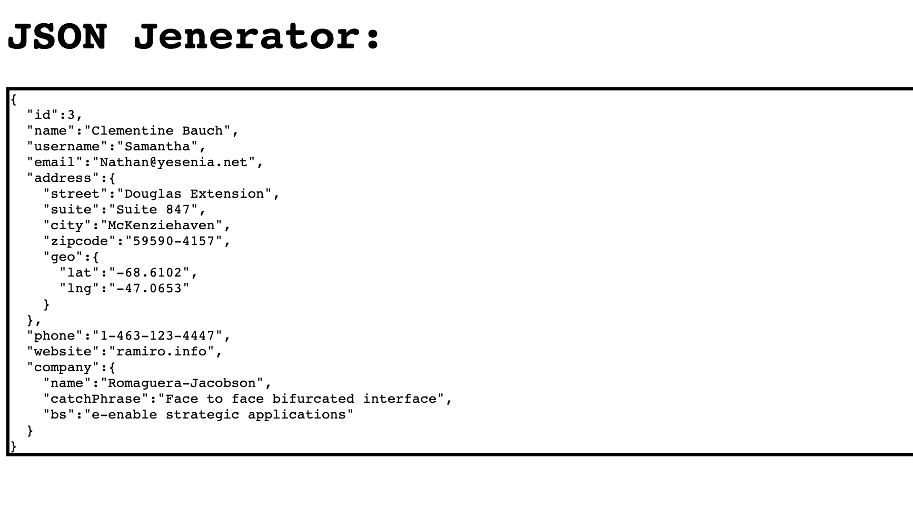

# XMLHttpRequests

* Creates a request object that contains relevant information that an API needs.
* Sends that request object to the API endpoint provided.
* Returns a promise that ultimately resolves to a response object, which contains the status of the promise with information the API sent back.
* The POST call takes two arguments an endpoint and an object that contains information needed for the POST request. The rest of the request is identical to the GET request.

### Here is another code example of a XMLHttpRequest

# Async/ Await Requests

* Using an async function that will return a promise.
* await can only be used in an async function. await allows a program to run while waiting for a promise to resolve.
* `async` is a keyword that is used to create functions that will return promises.
* `await` is a keyword that is used to tell a program to continue moving through the message queue while a promise resolves.
* `await` can only be used within functions declared with `async`.
* In a try...catch statement, code in the try block will be run and in the event of an exception/error, the code in the catch statement will run.

# Promises

* `fetch()` is a web API that can be used to create requests. `fetch()` will return promises.
* We can chain `.then()` methods to handle promises returned by `fetch()`.
* The `.json()` method converts a returned promise to a JSON object.
* Promises can be in one of three states: pending, resolved, or rejected.
* A promise is settled if it is either resolved or rejected.
* We should chain multiple promises rather than nesting them.
* To take advantage of concurrency, we can use `Promise.all()`.

## Running this code

You can run the code in the project by `cd` into the either GET or POST directory and running `http-server`.

All three examples will show a simple App using the various API calls. 

  

TRY/CATCH with a Json formatter App.
    
